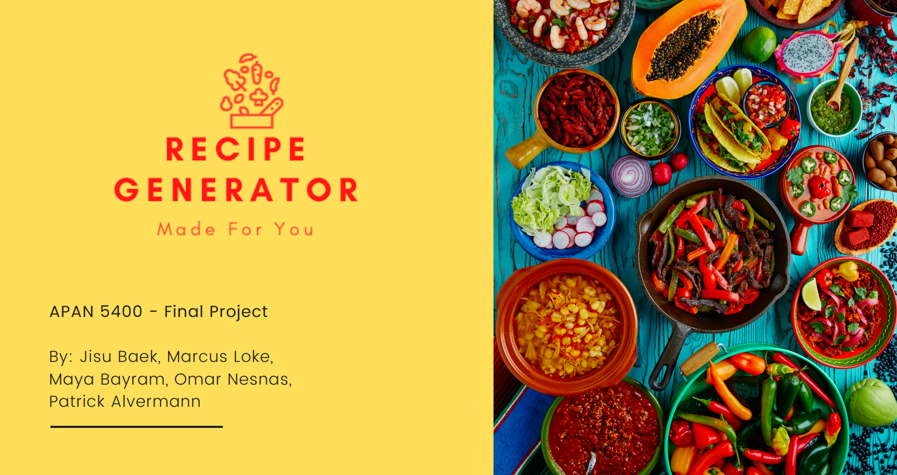

# Managing Data @ Columbia
## Fall 2021
## Recipe Generator App Project



### [Project Description](doc/)

Term: Fall 2021

+ Project title: Key themes in the schools of philosophy and their similarity to one another
+ This project is conducted by [Marcus Loke](https://www.linkedin.com/in/lokemarcus/)

+ Project summary: Studying and understanding philosophy can be very arduous for many, especially with the intangibleness of its contents that makes it highly elusive. Can we make it simpler for people to understand? Using data science techniques, this project therefore seeks to explicate the connection of ideas in philosophical texts in order to uncover salient themes for each of the thirteen (13) schools of philosophy and to find similarity between the schools of thought.

+ Key findings: *Stoicism* and *Nietzsche* are more similar in topics due to the similarity in language used. On the other hand, *Capitalism* and *Phenomenology* seem to be distinct and different from the rest because one uses very distinct economics terms while the other has words in German. Finally, every school of philosophy had a fair amount of probability of coming from topic 13 (see below), which is likely a topic that covers very generic philosophical words/themes that are more existential in nature like "time", "nature", "life", "reason", etc. Since *Capitalism* addresses less existential issues in general, then it makes sense that it is more distinct as a philosophical school when compared to the rest.


+ Techniques used: Data exploration, data munging, text mining, LDA (Latent Dirichlet Allocation).

+ Data source: The dataset was taken from the [Philosophy Data Project](http://philosophydata.com/index.html).

Following [suggestions](http://nicercode.github.io/blog/2013-04-05-projects/) by [RICH FITZJOHN](http://nicercode.github.io/about/#Team) (@richfitz). This folder is orgarnized as follows.

```
proj/
├── lib/
├── data/
├── doc/
├── figs/
└── output/
```

Please see each subfolder for a README file.
