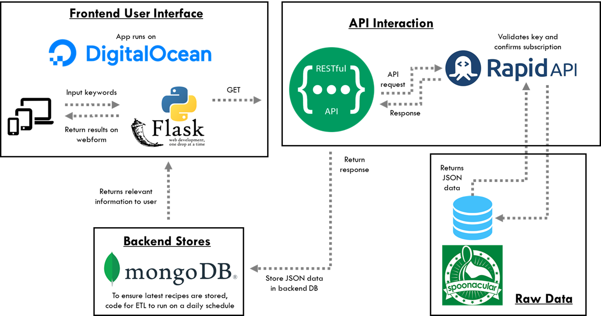
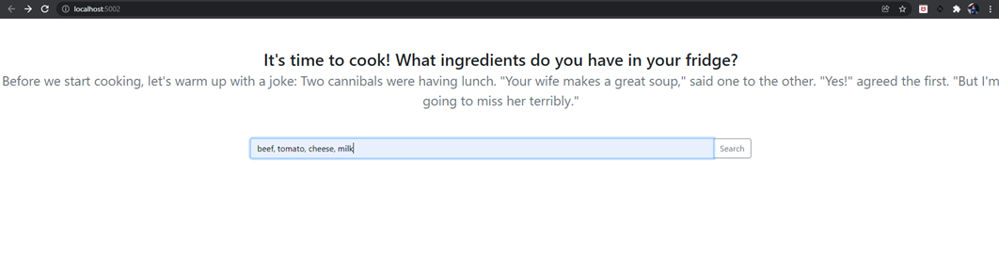

# Managing Data @ Columbia
## Fall 2021
## Recipe Generator App Project


### [Project Description](doc/)

Term: Fall 2021

+ Project title: Recipe Generator

+ Project summary: Our Recipe Generator aims to meet the above mentioned market demands by allowing users to search for recipes across the web. Essentially, the application will return recipes to users based on what ingredients they input into the search bar. Additionally, the application further filters to only return the recipes that use the prescribed ingredients.

+ Technologies used: Python, Python Flask, Pymongo, MongoDB, RapidAPI.

+ Data source: The data is queried from Spoonacular via [RapidAPI](https://rapidapi.com/spoonacular/api/recipe-food-nutrition/) as shown.



+ App UI: The app has an *input page* where users can key in what ingredients they have at home and a *results page* that returns a list of recipes that can be cooked with the available ingredients at home.

*Input page*:


*Results page*:


Following [suggestions](http://nicercode.github.io/blog/2013-04-05-projects/) by [RICH FITZJOHN](http://nicercode.github.io/about/#Team) (@richfitz). This folder is orgarnized as follows.

```
proj/
├── lib/
├── data/
├── doc/
├── figs/
└── output/
```

Please see each subfolder for a README file.
