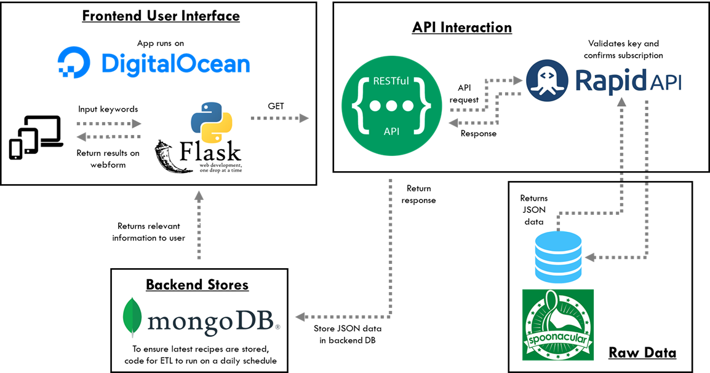

# Recipe Generator

### Data folder

The data directory contains data used in the analysis. This is treated as read only; in paricular the R/python files are never allowed to write to the files in here. Depending on the project, these might be csv files, a database, and the directory itself may have subdirectories.

The data is queried from Spoonacular via [RapidAPI](https://rapidapi.com/spoonacular/api/recipe-food-nutrition/) as shown:

